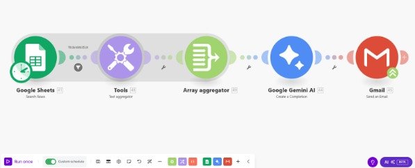
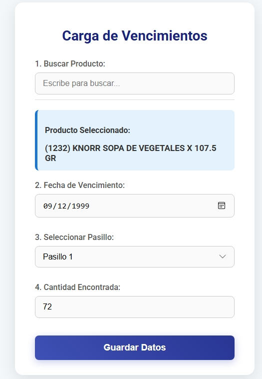
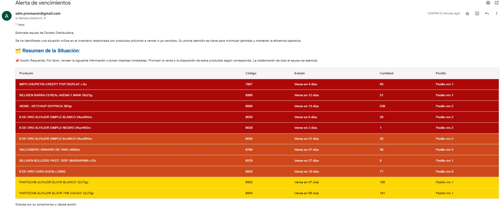

# 🟡 Automatización de Vencimientos para Distribuidora El Dorado – App + Workflow No-Code 🚀



## 📝 Resumen del Proyecto

Este proyecto forma parte de un trabajo práctico real realizado para una distribuidora mayorista. El objetivo fue **digitalizar y automatizar el control de productos con fecha de vencimiento**, optimizando el flujo de trabajo de los empleados de pasillo y los encargados de compras. Para ello, se desarrolló una **solución no-code** basada en Google Sites, Google Sheets y Make (Integromat), que permite:

- Carga intuitiva de productos desde el celular.
- Registro centralizado en tiempo real.
- Envío de alertas semanales automáticas según vencimientos críticos.

---

## 🎯 Requerimiento del Cliente

La distribuidora solicitó reemplazar su procedimiento manual (control con hojas impresas y lápiz) por una herramienta digital sencilla de usar. El sistema debía:

- Permitir la carga desde el celular de los productos próximos a vencer.
- Registrar ubicación, cantidad y fecha de vencimiento de cada ítem.
- Generar **avisos automáticos** a los responsables con anticipación suficiente para tomar decisiones.
- Ser escalable, sin costo de licencias y de bajo mantenimiento.

---

## 🔄 Flujo de Trabajo Automatizado



1. 🧍‍♂️ **El personal de pasillo** accede desde su celular a una app online hecha en Google Sites.
2. 📲 Carga los siguientes datos por producto:
   - Nombre (desde lista desplegable con búsqueda).
   - Fecha de vencimiento (vía calendario).
   - Número de pasillo.
   - Cantidad encontrada.
3. 🗃️ La información queda registrada automáticamente en un Google Sheet estructurado como base de datos.
4. 📤 Todos los lunes, Make analiza la base de datos y envía correos automáticos a los encargados con:
   - 🟨 Productos con vencimiento entre 60 y 31 días.
   - 🟥 Productos con vencimiento en 30 días o menos.
  


---

## 🛠️ Tecnologías Utilizadas

| Herramienta         | Rol en el Proyecto                            |
|---------------------|-----------------------------------------------|
| Google Sites        | Interfaz web para cargar datos desde celular. |
| Google Sheets       | Base de datos central para los registros.     |
| Make (Integromat)   | Automatización de alertas semanales por mail.|
| Google App Script   | Autocompletado inteligente y validaciones.    |

---

## 🔍 Detalles Técnicos Clave

- ✔️ App diseñada **100% para uso móvil**.
- ✔️ Validaciones automáticas para evitar errores (listas desplegables, formatos de fecha).
- ✔️ Actualización en tiempo real gracias a la conexión Sheets–Sites.
- ✔️ Automatización de alertas basada en reglas definidas (60 y 30 días).
- ✔️ Bajo costo: solución íntegramente no-code y gratuita.
- ✔️ Permisos controlados en la hoja de datos (edición restringida).

---

## 🧪 Validaciones y Pruebas

Se realizaron pruebas intensivas antes del despliegue:

- Testeo en dispositivos móviles y escritorio.
- Simulación de cargas de productos y fechas próximas a vencer.
- Verificación del correcto registro en Sheets.
- Confirmación del envío de alertas desde Make.
- Validación de la experiencia de usuario y rapidez de carga.

---

## 📈 Resultados Obtenidos

| Métrica                          | Resultado                             |
|----------------------------------|----------------------------------------|
| ⏱️ Reducción de tiempo manual     | ~90%                                   |
| ✅ Adopción por parte del equipo  | Completa y sin resistencia             |
| 📨 Alertas enviadas semanalmente | Automatizadas, sin intervención humana|
| 📊 Datos estructurados y listos  | Para futuros dashboards o reportes     |

---

## 🧠 Lecciones y Escalabilidad

El proyecto demostró que incluso con herramientas no-code es posible:

- **Digitalizar procesos críticos** de forma eficiente.
- Reducir errores humanos al mínimo.
- Liberar tiempo de los responsables para tareas de mayor valor.
- Generar **datos históricos** útiles para decisiones futuras.

### Próximas funcionalidades sugeridas por el cliente:

- 📅 Alertas **diarias** con resúmenes automáticos.
- 📈 Métricas por desempeño del personal (por pasillo).
- 🛒 Automatización de pedidos según vencimientos.
- 🧾 Generación de contenido promocional automático.
- 🔗 Integración con software de ventas.

---

```markdown

